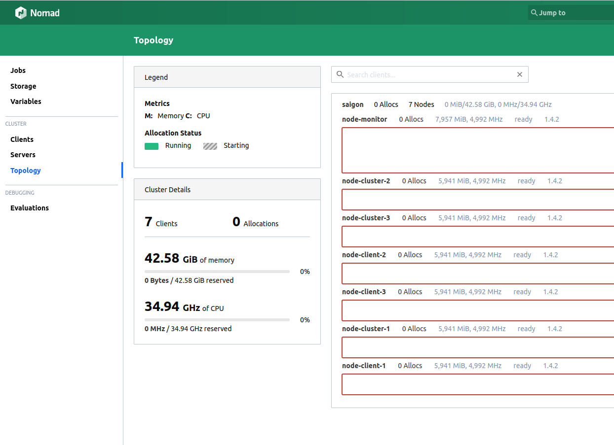

# Practice and Learn - How to use Nomad, Consul, and Vault in production for the beginner

> I'm a backend developer (Java/Go/Php/Python), so I don't have much experience with DevOps except using Jenkins and Docker/Docker Compose. My company is a small startup company, we don't have a DevOps team responsible for CI/CD in production. I've just learned about Hashicorp for two weeks til I decided to write this tutorial but I'll try to complete the things. If I missed anything your contributions are welcome.

## Getting started

### Before you start

*If you're absolute beginner, please watch the [official getting started](https://www.youtube.com/watch?v=xl58mjMJjrg) video from Hashicorp* to get some basic concepts

###  Requisition
I'm using VMs ([multipass](https://multipass.run/)) on Ubuntu 22.04 for this tutorial. Ensure that you install Multipass on your machine before you go
> If you do set up on physical machines, run 2 scripts below to install, and set up docker, nomad, and consul on each machine.
>
> ```shell
> bash -c "$(curl -fsSL https://gist.github.com/tuyendev/3a3bca421b6689f73c670257090b5d34/raw/> c31f3de439c5ac86c4e4c7b50bf95a26988b0bd5/nomad-consul-prerequisite.sh)"
> ```
> ```shell
> bash -c "$(curl -fsSL https://gist.github.com/tuyendev/63a0a75c1abd354199fd12ef04bacafe/raw/> 71c7f72cc21943fd8679ad148c4494a55f627dc9/consul-nomad-install.sh)"
> ```

##### Create VMs command
```shell
sh create-vm.sh
```

#### Server Information
> IP Servers may be different


This structure required at least 4 servers including:
- **3 servers** for the core cluster with Nomad (Client/Server installed), Consul (Client/Server installed) 
    - *Since Nomad Client run with Nomad Server in a each cluster node, applications also can run here*
- **1 server** for monitoring (granfana, promethues, autoscaler, etc)
- **Number of servers** for client node where applications will be run more effective (I chose 3 for the tutorial)

**Node environment**
- OS: Ubuntu 20.04
- Docker: Latest Version
- Consul: 13.3
- Nomad: 1.4.2
- Vault: Latest Version
- Domain: bssd.vn ( used for configuration and dns service )
### Setup Nomad - Consul

**Ref**
- [Consul's Deployment Guide](https://developer.hashicorp.com/consul/tutorials/production-deploy/deployment-guide)
- [Installing Nomad for Production](https://developer.hashicorp.com/nomad/docs/install/production)

**Detail**

1. [Setup cluster Node](./nomad-consul-cluster.md)
2. [Secure cluster Node (Basic)](./secure-nomad-consul.md)
3. [Setup client/agent Node](./nomad-consul-client.md)

**Result**





### Setup Job with auto scaler

1. [Setup Proxy Job](./nomad-traefik-job.md)
2. [Setup Backend Job](./nomad-backend-job.md)
