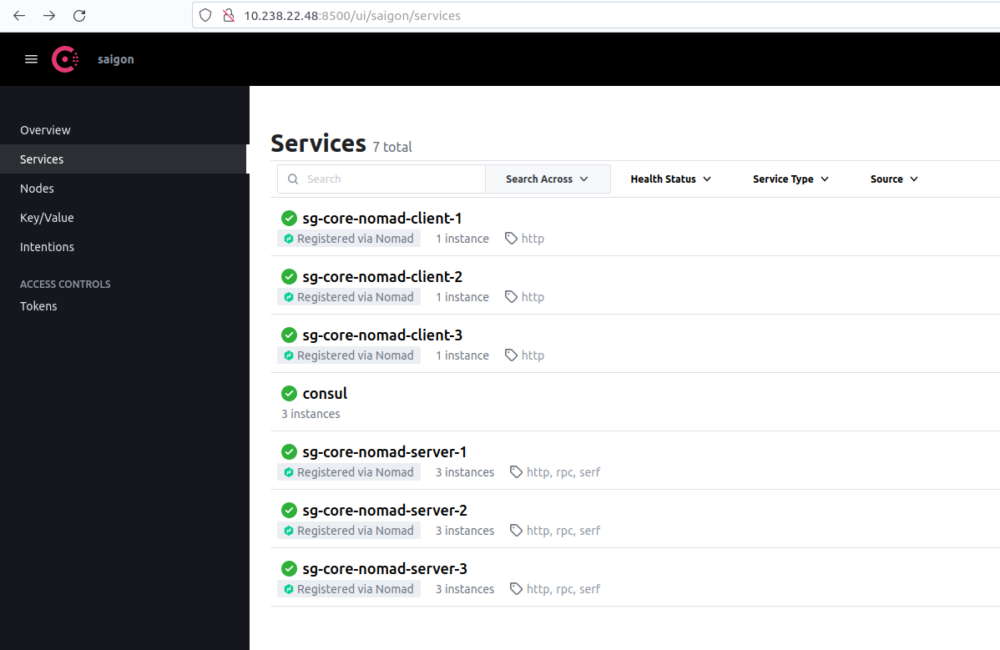

# Practice and Learn - How to use Nomad, Consul, and Vault in production for the beginner

> I'm a backend developer (Java/Go/Php/Python), so I don't have much experience with DevOps except using Jenkins and Docker/Docker Compose. My company is a small startup company, we don't have a DevOps team responsible for CI/CD in production. I've just learned about Hashicorp for two weeks til I decided to write this tutorial but I'll try to complete the things. If I missed anything your contributions are welcome.

## Getting started

### Before you start

*If you're absolute beginner, please watch the [official getting started](https://www.youtube.com/watch?v=xl58mjMJjrg) video from Hashicorp* to get some basic concepts

###  Requisition
I'm using VMs ([multipass](https://multipass.run/)) on Ubuntu 22.04 for this tutorial. Ensure that you install Multipass on your machine before you go
> If you do set up on physical machines, run 2 scripts below to install, and set up docker, nomad, and consul on each machine.
>
> ```shell
> bash -c "$(curl -fsSL https://gist.github.com/tuyendev/3a3bca421b6689f73c670257090b5d34/raw/> c31f3de439c5ac86c4e4c7b50bf95a26988b0bd5/nomad-consul-prerequisite.sh)"
> ```
> ```shell
> bash -c "$(curl -fsSL https://gist.github.com/tuyendev/63a0a75c1abd354199fd12ef04bacafe/raw/> 71c7f72cc21943fd8679ad148c4494a55f627dc9/consul-nomad-install.sh)"
> ```

#### Server Information


This structure required at least 4 servers including:
- **3 servers** for the core cluster with Nomad (Client/Server installed), Consul (Client/Server installed) 
    - *Since Nomad Client run with Nomad Server in a each cluster node, applications also can run here*
- **1 server** for monitoring (granfana, promethues, autoscaler, etc)
- **Number of servers** for client node where applications will be run more effective (I chose 3 for the tutorial)

**Node environment**
- OS: Ubuntu 20.04
- Docker: Latest Version
- Consul: 13.3
- Nomad: 1.4.2
- Vault: Latest Version

### Setup [Name: node-cluster-1 <-> IP: 10.238.22.45]
#### Setup Consul 

1. Generate a secrect key

```shell
consul keygen

##### OUTPUT #####
BNWu/UhiUQZMSHgAovDzGG/sCxohYpBS81nXoDhsND4=
```
> This key will be used for share configuration in all consul nodes, note it somewhere

2. Generate TLS certificates for RPC encryption

> Consul can use TLS to verify the authenticity of servers and clients.

- Create the Certificate Authority

```shell
mkdir ~/certs
```
```shell
cd ~/certs && consul tls ca create -domain bssd.vn
	
##### OUTPUT #####
==> Saved bssd.vn-agent-ca.pem
==> Saved bssd.vn-agent-ca-key.pem
```

- Create the certificates

```shell
cd ~/certs && consul tls cert create -server -dc saigon -domain bssd.vn
##### OUTPUT #####
==> WARNING: Server Certificates grants authority to become a
    server and access all state in the cluster including root keys
    and all ACL tokens. Do not distribute them to production hosts
    that are not server nodes. Store them as securely as CA keys.
==> Using bssd.vn-agent-ca.pem and bssd.vn-agent-ca-key.pem
==> Saved saigon-server-bssd.vn-0.pem
==> Saved saigon-server-bssd.vn-0-key.pem
```

- Copy to configuration folder /opt/consul/certs & keep a backup

```shell
sudo cp -R ~/certs/* /opt/consul/certs
sudo chown -R consul:consul /opt/consul && sudo chmod a+r -R /opt/consul/certs
```

3. Configuration

- **/etc/consul.d/consul.hcl**

```shell
sudo nano /etc/consul.d/consul.hcl

##### content #####
datacenter             = "saigon"
domain                 = "bssd.vn"
node_name              = "sg-core-consul-1"
data_dir               = "/opt/consul"
encrypt                = "BNWu/UhiUQZMSHgAovDzGG/sCxohYpBS81nXoDhsND4=" ### Encrypt key from Step 1
verify_incoming        = true
verify_outgoing        = true
verify_server_hostname = true
ca_file                = "/opt/consul/certs/bssd.vn-agent-ca.pem"
cert_file              = "/opt/consul/certs/saigon-server-bssd.vn-0.pem"
key_file               = "/opt/consul/certs/saigon-server-bssd.vn-0-key.pem"

auto_encrypt {
  allow_tls = true
}

retry_join = ["10.238.22.45", "10.238.22.50", "10.238.22.48"] ### List of all consul server ( CORE NODES )

acl {
  enabled                  = true
  default_policy           = "allow"
  enable_token_persistence = true
}

performance {
  raft_multiplier = 1
}
```

- **/etc/consul.d/server.hcl**

```bash
sudo nano /etc/consul.d/server.hcl

##### content #####
server           = true
bootstrap_expect = 3
bind_addr        = "10.238.22.45"
client_addr      = "0.0.0.0"
connect {
  enabled = true
}
addresses {
  grpc = "127.0.0.1"
}
ports {
  grpc = 8502
}
ui_config {
  enabled = true
}
```

4. Start service

```bash
sudo systemctl restart consul
sudo systemctl status consul
```

#### Setup nomad

1. Configuration

- **/etc/nomad.d/nomad.hcl**

```bash
sudo nano /etc/nomad.d/nomad.hcl

##### content #####
datacenter = "saigon"
data_dir   = "/opt/nomad"
bind_addr  = "10.238.22.45"
acl {
  enabled = true
}
# used for prometheus
telemetry {
  collection_interval = "1s"
  disable_hostname = true
  prometheus_metrics = true
  publish_allocation_metrics = true
  publish_node_metrics = true
}
# setting docker plugin
plugin "docker" {
  config {
    endpoint = "unix:///var/run/docker.sock"
    volumes {
      enabled      = true
      selinuxlabel = "z"
    }
    extra_labels = ["job_name", "job_id", "task_group_name", "task_name", "namespace", "node_name", "node_id"]

    gc {
      image       = true
      image_delay = "10m"
      container   = true

      dangling_containers {
        enabled        = true
        dry_run        = false
        period         = "5m"
        creation_grace = "5m"
      }
    }
    allow_privileged = true
    
  }
}
```

- **/etc/nomad.d/server.hcl**

```bash
sudo nano /etc/nomad.d/server.hcl

##### content #####
server {
  enabled          = true
  bootstrap_expect = 3
  server_join {
    retry_join = ["10.238.22.45:4648", "10.238.22.50:4648", "10.238.22.48:4648"]  # List IP of nomad server ( CORE NODES )
  }
}
```

- **/etc/nomad.d/client.hcl**

```bash
sudo nano /etc/nomad.d/client.hcl

##### content #####
client {
  enabled    = true
  node_class = "core"
  server_join {
    #NOMAD SERVER LIST
    retry_join = ["10.238.22.45:4647", "10.238.22.50:4647", "10.238.22.48:4647"]
  }
}
```

- **/etc/nomad.d/consul.hcl**

```bash
sudo nano /etc/nomad.d/consul.hcl

##### content #####
consul {
  address = "127.0.0.1:8500"
  server_service_name = "sg-core-nomad-server-1"
  client_service_name = "sg-core-nomad-client-1"
  auto_advertise = true
  server_auto_join = true
  client_auto_join = true
}
```
2. Start service

```bash
sudo systemctl start nomad && sudo systemctl status nomad
```

### Setup [Name: node-cluster-2 <-> IP: 10.238.22.50]
#### Setup Consul 

> ONLY DO STEP 1,2 IF YOU INSTALL ON PHYSICAL MACHINES
1. Copy backup `~/certs` from node-cluster-1` to `node-cluster-2`

2. Run command 

```
sudo cp -R ~/certs/* /opt/consul/certs
sudo chown -R consul:consul /opt/consul && sudo chmod a+r -R /opt/consul/certs
```


3. Configuration

- **/etc/consul.d/consul.hcl**

```shell
sudo nano /etc/consul.d/consul.hcl

##### content #####
datacenter             = "saigon"
domain                 = "bssd.vn"
node_name              = "sg-core-consul-2"
data_dir               = "/opt/consul"
encrypt                = "BNWu/UhiUQZMSHgAovDzGG/sCxohYpBS81nXoDhsND4=" ### Encrypt key from Step 1
verify_incoming        = true
verify_outgoing        = true
verify_server_hostname = true
ca_file                = "/opt/consul/certs/bssd.vn-agent-ca.pem"
cert_file              = "/opt/consul/certs/saigon-server-bssd.vn-0.pem"
key_file               = "/opt/consul/certs/saigon-server-bssd.vn-0-key.pem"

auto_encrypt {
  allow_tls = true
}

retry_join = ["10.238.22.45", "10.238.22.50", "10.238.22.48"] ### List of all consul server ( CORE NODES )

acl {
  enabled                  = true
  default_policy           = "allow"
  enable_token_persistence = true
}

performance {
  raft_multiplier = 1
}
```

- **/etc/consul.d/server.hcl**

```bash
sudo nano /etc/consul.d/server.hcl

##### content #####
server           = true
bootstrap_expect = 3
bind_addr        = "10.238.22.50"
client_addr      = "0.0.0.0"
connect {
  enabled = true
}
addresses {
  grpc = "127.0.0.1"
}
ports {
  grpc = 8502
}
ui_config {
  enabled = true
}
```

4. Start service

```bash
sudo systemctl restart consul
sudo systemctl status consul
```

#### Setup nomad

1. Configuration

- **/etc/nomad.d/nomad.hcl**

```bash
sudo nano /etc/nomad.d/nomad.hcl

##### content #####
datacenter = "saigon"
data_dir   = "/opt/nomad"
bind_addr  = "10.238.22.50"
acl {
  enabled = true
}
# used for prometheus
telemetry {
  collection_interval = "1s"
  disable_hostname = true
  prometheus_metrics = true
  publish_allocation_metrics = true
  publish_node_metrics = true
}
# setting docker plugin
plugin "docker" {
  config {
    endpoint = "unix:///var/run/docker.sock"
    volumes {
      enabled      = true
      selinuxlabel = "z"
    }
    extra_labels = ["job_name", "job_id", "task_group_name", "task_name", "namespace", "node_name", "node_id"]

    gc {
      image       = true
      image_delay = "10m"
      container   = true

      dangling_containers {
        enabled        = true
        dry_run        = false
        period         = "5m"
        creation_grace = "5m"
      }
    }
    allow_privileged = true
    
  }
}
```

- **/etc/nomad.d/server.hcl**

```bash
sudo nano /etc/nomad.d/server.hcl

##### content #####
server {
  enabled          = true
  bootstrap_expect = 3
  server_join {
    retry_join = ["10.238.22.45:4648", "10.238.22.50:4648", "10.238.22.48:4648"]  # List IP of nomad server ( CORE NODES )
  }
}
```

- **/etc/nomad.d/client.hcl**

```bash
sudo nano /etc/nomad.d/client.hcl

##### content #####
client {
  enabled    = true
  node_class = "core"
  server_join {
    #NOMAD SERVER LIST
    retry_join = ["10.238.22.45:4647", "10.238.22.50:4647", "10.238.22.48:4647"]
  }
}
```

- **/etc/nomad.d/consul.hcl**

```bash
sudo nano /etc/nomad.d/consul.hcl

##### content #####
consul {
  address = "127.0.0.1:8500"
  server_service_name = "sg-core-nomad-server-2"
  client_service_name = "sg-core-nomad-client-2"
  auto_advertise = true
  server_auto_join = true
  client_auto_join = true
}
```
2. Start service

```bash
sudo systemctl start nomad && sudo systemctl status nomad
```

### Setup [Name: node-cluster-3 <-> IP: 10.238.22.48]
#### Setup Consul 

> ONLY DO STEP 1,2 IF YOU INSTALL ON PHYSICAL MACHINES
1. Copy backup `~/certs` from node-cluster-1` to `node-cluster-2`

2. Run command 

```
sudo cp -R ~/certs/* /opt/consul/certs
sudo chown -R consul:consul /opt/consul && sudo chmod a+r -R /opt/consul/certs
```


3. Configuration

- **/etc/consul.d/consul.hcl**

```shell
sudo nano /etc/consul.d/consul.hcl

##### content #####
datacenter             = "saigon"
domain                 = "bssd.vn"
node_name              = "sg-core-consul-3"
data_dir               = "/opt/consul"
encrypt                = "BNWu/UhiUQZMSHgAovDzGG/sCxohYpBS81nXoDhsND4=" ### Encrypt key from Step 1
verify_incoming        = true
verify_outgoing        = true
verify_server_hostname = true
ca_file                = "/opt/consul/certs/bssd.vn-agent-ca.pem"
cert_file              = "/opt/consul/certs/saigon-server-bssd.vn-0.pem"
key_file               = "/opt/consul/certs/saigon-server-bssd.vn-0-key.pem"

auto_encrypt {
  allow_tls = true
}

retry_join = ["10.238.22.45", "10.238.22.50", "10.238.22.48"] ### List of all consul server ( CORE NODES )

acl {
  enabled                  = true
  default_policy           = "allow"
  enable_token_persistence = true
}

performance {
  raft_multiplier = 1
}
```

- **/etc/consul.d/server.hcl**

```bash
sudo nano /etc/consul.d/server.hcl

##### content #####
server           = true
bootstrap_expect = 3
bind_addr        = "10.238.22.48"
client_addr      = "0.0.0.0"
connect {
  enabled = true
}
addresses {
  grpc = "127.0.0.1"
}
ports {
  grpc = 8502
}
ui_config {
  enabled = true
}
```

4. Start service

```bash
sudo systemctl restart consul
sudo systemctl status consul
```

#### Setup nomad

1. Configuration

- **/etc/nomad.d/nomad.hcl**

```bash
sudo nano /etc/nomad.d/nomad.hcl

##### content #####
datacenter = "saigon"
data_dir   = "/opt/nomad"
bind_addr  = "10.238.22.48"
acl {
  enabled = true
}
# used for prometheus
telemetry {
  collection_interval = "1s"
  disable_hostname = true
  prometheus_metrics = true
  publish_allocation_metrics = true
  publish_node_metrics = true
}
# setting docker plugin
plugin "docker" {
  config {
    endpoint = "unix:///var/run/docker.sock"
    volumes {
      enabled      = true
      selinuxlabel = "z"
    }
    extra_labels = ["job_name", "job_id", "task_group_name", "task_name", "namespace", "node_name", "node_id"]

    gc {
      image       = true
      image_delay = "10m"
      container   = true

      dangling_containers {
        enabled        = true
        dry_run        = false
        period         = "5m"
        creation_grace = "5m"
      }
    }
    allow_privileged = true
    
  }
}
```

- **/etc/nomad.d/server.hcl**

```bash
sudo nano /etc/nomad.d/server.hcl

##### content #####
server {
  enabled          = true
  bootstrap_expect = 3
  server_join {
    retry_join = ["10.238.22.45:4648", "10.238.22.50:4648", "10.238.22.48:4648"]  # List IP of nomad server ( CORE NODES )
  }
}
```

- **/etc/nomad.d/client.hcl**

```bash
sudo nano /etc/nomad.d/client.hcl

##### content #####
client {
  enabled    = true
  node_class = "core"
  server_join {
    #NOMAD SERVER LIST
    retry_join = ["10.238.22.45:4647", "10.238.22.50:4647", "10.238.22.48:4647"]
  }
}
```

- **/etc/nomad.d/consul.hcl**

```bash
sudo nano /etc/nomad.d/consul.hcl

##### content #####
consul {
  address = "127.0.0.1:8500"
  server_service_name = "sg-core-nomad-server-3"
  client_service_name = "sg-core-nomad-client-3"
  auto_advertise = true
  server_auto_join = true
  client_auto_join = true
}
```
2. Start service

```bash
sudo systemctl start nomad && sudo systemctl status nomad
```
### Result

> Access any link to see the result

- http://10.238.22.50:8500
- http://10.238.22.45:8500
- http://10.238.22.48:8500

