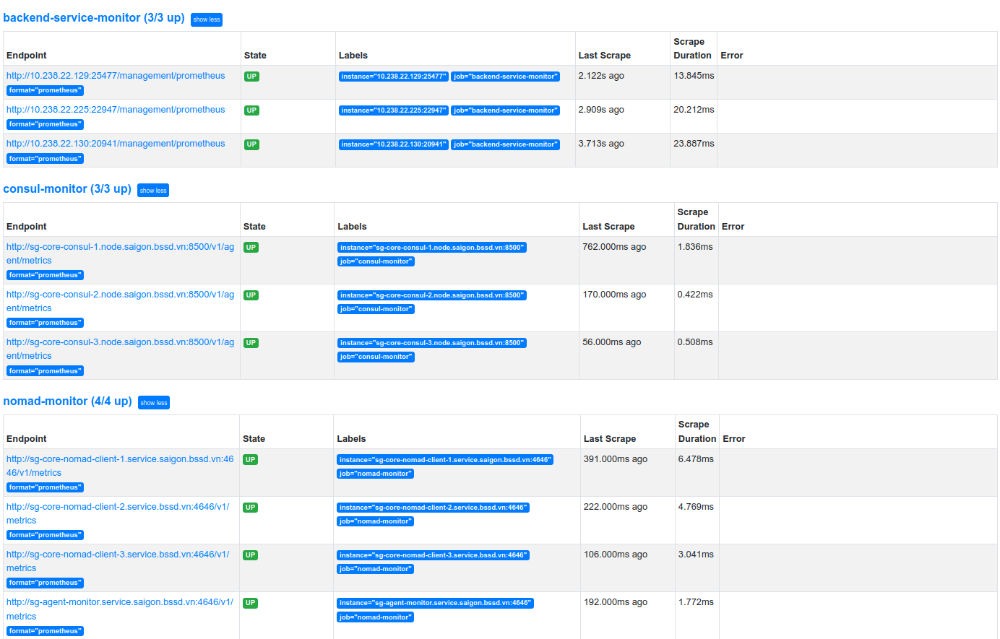

# Deploy Prometheus job

1. Job detail

```hcl
job "prometheus" {
  datacenters = ["saigon"]
  type        = "service"

  group "monitoring" {
    count = 1

    network {
      port "prometheus_ui" {
        static = 9090
      }
    }

    task "prometheus" {
      driver = "docker"
      constraint {
        attribute = "${node.class}"
        operator  = "="
        value     = "monitor"
      }
      config {
        image        = "prom/prometheus:v2.40.5"
        ports        = ["prometheus_ui"]
        network_mode = "host"

        args = [
          "--config.file=/etc/prometheus/config/prometheus.yml",
          "--storage.tsdb.path=/prometheus",
          "--web.listen-address=0.0.0.0:${NOMAD_PORT_prometheus_ui}",
          "--web.console.libraries=/usr/share/prometheus/console_libraries",
          "--web.console.templates=/usr/share/prometheus/consoles",
        ]

        volumes = [
          "local/config:/etc/prometheus/config",
        ]
      }

      template {
        change_mode = "noop"
        destination = "local/config/alert.yml"
        data = <<EOH
---
groups:
- name: prometheus_alerts
  rules:
  - alert: Backend down
    expr: absent(up{job="backend-service-monitor"})
    for: 10s
    labels:
      severity: critical
    annotations:
      description: "Our backend is down."
EOH
      }

      template {
        data = <<EOH
---
global:
  scrape_interval:     1s
  evaluation_interval: 1s

alerting:
  alertmanagers:
  - consul_sd_configs:
    - server: 'sg-core-consul-1.node.saigon.bssd.vn:8500'
      services: ['alertmanager']

rule_files:
  - "alert.yml"

scrape_configs:
  - job_name: consul-monitor
    metrics_path: /v1/agent/metrics
    params:
      format: ['prometheus']
    static_configs:
    - targets: ['sg-core-consul-1.node.saigon.bssd.vn:8500', 'sg-core-consul-2.node.saigon.bssd.vn:8500', 'sg-core-consul-3.node.saigon.bssd.vn:8500']
  - job_name: nomad-monitor
    metrics_path: /v1/metrics
    params:
      format: ['prometheus']
    static_configs:
    - targets: ['sg-core-nomad-client-1.service.saigon.bssd.vn:4646', 'sg-core-nomad-client-2.service.bssd.vn:4646', 'sg-core-nomad-client-3.service.bssd.vn:4646', 'sg-agent-monitor.service.saigon.bssd.vn:4646']
  - job_name: backend-service-monitor
    scrape_interval: 5s
    metrics_path: /management/prometheus
    params:
      format: ['prometheus']
    consul_sd_configs:
    - server: 'sg-core-consul-1.node.saigon.bssd.vn:8500'
      services:
        - 'backend-service'
    - server: 'sg-core-consul-2.node.saigon.bssd.vn:8500'
      services:
        - 'backend-service'
    - server: 'sg-core-consul-2.node.saigon.bssd.vn:8500'
      services:
        - 'backend-service'
  - job_name: alert-server-monitor
    scrape_interval: 5s
    params:
      format: ['prometheus']
    consul_sd_configs:
    - server: 'sg-core-consul-1.node.saigon.bssd.vn:8500'
      services:
        - 'alertmanager'
    - server: 'sg-core-consul-2.node.saigon.bssd.vn:8500'
      services:
        - 'alertmanager'
    - server: 'sg-core-consul-2.node.saigon.bssd.vn:8500'
      services:
        - 'alertmanager'
EOH

        change_mode   = "signal"
        change_signal = "SIGHUP"
        destination   = "local/config/prometheus.yml"
      }

      resources {
        cpu    = 100
        memory = 256
      }

      service {
        name = "prometheus"
        port = "prometheus_ui"
        tags = [
          "traefik.enable=true",
          "traefik.http.routers.prometheus-route.entrypoints=monitor",
          "traefik.http.routers.prometheus-route.service=prometheus",
          "traefik.http.routers.prometheus-route.rule=PathPrefix(`/`)",
        ]
        check {
          type     = "http"
          path     = "/-/healthy"
          interval = "10s"
          timeout  = "2s"
        }
      }
    }
  }
}
```

2. Deploy alert job

```hcl
job "alertmanager" {
  datacenters = ["saigon"]
  type        = "service"

  group "alerting" {
    count = 1
    restart {
      attempts = 2
      interval = "30m"
      delay    = "15s"
      mode     = "fail"
    }
    ephemeral_disk {
      size = 300
    }
    network {
      port "alertmanager_ui" {
        static = 9093
      }
    }
    task "alertmanager" {
      driver = "docker"
      constraint {
        attribute = "${node.class}"
        operator  = "="
        value     = "monitor"
      }
      config {
        image        = "prom/alertmanager:latest"
        network_mode = "host"
        ports        = ["alertmanager_ui"]
      }

      service {
        name = "alertmanager"
        port = "alertmanager_ui"
        tags = [
          "traefik.enable=true",
          "traefik.http.routers.alert-route.entrypoints=monitor",
          "traefik.http.routers.alert-route.service=alertmanager",
          "traefik.http.routers.alert-route.rule=PathPrefix(`/alertmanager`)",
          "traefik.http.routers.alert-route.middlewares=alert-stripprefix",
          "traefik.http.middlewares.alert-stripprefix.stripprefix.prefixes=/alertmanager",
        ]
        check {
          type     = "http"
          path     = "/-/healthy"
          interval = "10s"
          timeout  = "2s"
        }
      }
    }
  }
}
```
3. Result

