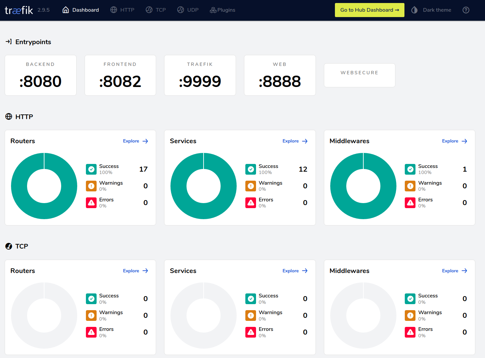

# Setup Proxy Job (Traefik)
> We need a proxy to cover all created services from Nomad with random port number, instance

1. Create service policy 

```shell
cd ~ &&  echo "
service \"traefik\" {
        policy = \"write\"
}
service \"traefik-sidecar-proxy\" {
        policy = \"write\"
}
service_prefix \"\" {
        policy = \"read\"
}
node_prefix \"\" {
        policy = \"read\"
}
"| tee traefik-policy.hcl
```

2. Deploy policy

```shell
consul acl policy create -name "traefik-service" -description "Traefik Proxy Service Access Policy" -rules @traefik-policy.hcl
```
3. Create token from policy

```shell
consul acl token create -description "Traefik Service Token" -policy-name "traefik-service"| tee traefik-service.token

##### OUTPUT #####
AccessorID:       53078cee-9f5d-e78d-7928-8850b9934485
SecretID:         aae2f550-a21c-b20f-90ab-f939e1d35536 <=================== Save the key for deployment
Description:      Traefik Service Token
Local:            false
Create Time:      2022-11-21 15:35:03.275568004 +0700 +07
Policies:
   d0a1ca0f-ee56-b0bd-dbb4-80f661ce393c - traefik-service
```

4. Deploy job with describe

```hcl
job "proxy" {
  datacenters = ["saigon"]
  type        = "system"

  group "traefik" {
    count = 1

    network {
      port "web" {
        static = 8888
      }
      port "admin" {
        static = 9999
      }
      port "monitor" {
        static = 9000
      }
      port "backend" {
        static = 8080
      }
      port "frontend" {
        static = 8082
      }
    }

    service {
      name     = "traefik"
      provider = "consul"
      port     = "web"
      check {
        name     = "alive"
        type     = "tcp"
        port     = "web"
        interval = "10s"
        timeout  = "2s"
      }
      tags = [
          "traefik.enable=true",
          "traefik.http.routers.dashboard.rule=(PathPrefix(`/api/`) || PathPrefix(`/dashboard/`))",
          "traefik.http.routers.dashboard.service=api@internal",
          "traefik.http.routers.dashboard.middlewares=auth",
          "traefik.http.routers.dashboard.entrypoints=traefik",
          "traefik.http.middlewares.auth.basicauth.users=demo:$apr1$cznldywe$ZmKZw8RpO6sZc5GqUN0xp/",
      ]
      
    }

    task "traefik" {
      driver = "docker"
      constraint {
        attribute = "${node.class}"
        operator  = "="
        value     = "core"
      }
      config {
        image        = "traefik:2.9.5"
        ports        = ["admin", "web", "monitor", "backend", "frontend"]
        network_mode = "host"
        args = [
          "--log.level=DEBUG",
          "--api",
          "--entrypoints.web.address=:${NOMAD_PORT_web}",
          "--entrypoints.traefik.address=:${NOMAD_PORT_admin}",
          "--entrypoints.monitor.address=:${NOMAD_PORT_monitor}",
          "--entrypoints.backend.address=:${NOMAD_PORT_backend}",
          "--entrypoints.frontend.address=:${NOMAD_PORT_frontend}",
          "--entrypoints.websecure.http.tls=true",
          "--providers.consulCatalog.exposedByDefault=true",
          "--providers.consulCatalog.prefix=traefik",
          "--providers.consulcatalog.endpoint.address=127.0.0.1:8500",
          "--providers.consulcatalog.endpoint.token=c870186b-722c-5297-66bf-9eb0c191f578", # This key is taken from above
          "--providers.consulcatalog.endpoint.scheme=http"
        ]
      }
      resources {
        cpu        = 100
        memory     = 512
        memory_max = 2048
      }
    }
  }
}
```

5. Access via links:
> **Username/Password: demo/demo**
 - http://10.238.22.45:9999/dashboard/
 - http://10.238.22.50:9999/dashboard/
 - http://10.238.22.48:9999/dashboard/


