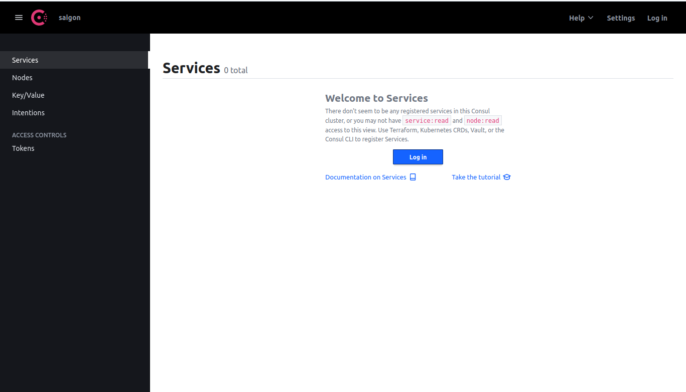
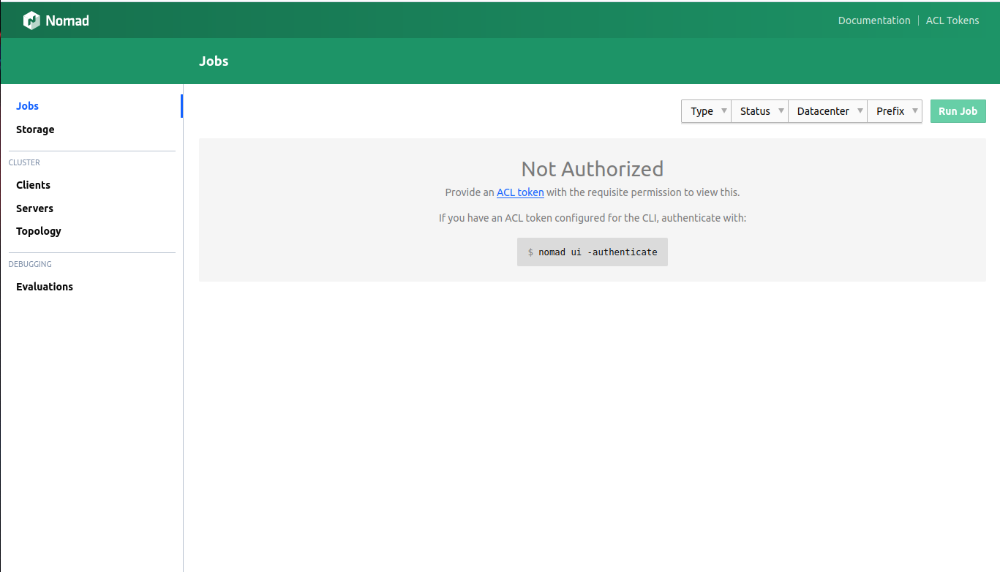

# Secure Nomad & Consul Server/Cluster Node ( Basic )

## Secure Consul
1. Bootstrap ACL ( run in any cluster node )

```shell
consul acl bootstrap

##### OUTPUT #####
AccessorID:       fd5021a3-7959-7c23-3637-22157fe6724d
SecretID:         0915a8fc-293e-e6cc-4e38-5dcd41f98bc1
Description:      Bootstrap Token (Global Management)
Local:            false
Create Time:      2022-12-01 14:13:57.420140598 +0700 +07
Policies:
   00000000-0000-0000-0000-000000000001 - global-management
```

> Take note for SecretID, we will use that key for later steps

2. Export SecretID key to bash env (run on all cluster nodes)
> You actually don't need to run the script below on all cluster node, but to make administration easier, I recommend do it on all cluster nodes

```shell
echo 'export CONSUL_HTTP_TOKEN="0915a8fc-293e-e6cc-4e38-5dcd41f98bc1"  
export CONSUL_MGMT_TOKEN="0915a8fc-293e-e6cc-4e38-5dcd41f98bc1"' | tee -a ~/.bashrc && \
source ~/.bashrc
```

3. Create default policy for node

```shell
cd ~ && \
echo "agent_prefix \"\" { 
 policy = \"write\" 
} 
node_prefix \"\" { 
 policy = \"write\" 
} 
service_prefix \"\" { 
 policy = \"read\" 
} 
session_prefix \"\" { 
 policy = \"read\" 
}" | tee -a node-policy.hcl
```

4. Apply policy

```shell
consul acl policy create -token=${CONSUL_MGMT_TOKEN} -name node-policy -rules @node-policy.hcl
```

5. Create a token from bootstrap policy

```shell
consul acl token create -token=${CONSUL_MGMT_TOKEN} -description "node token" -policy-name node-policy

##### OUTPUT #####
AccessorID:       ba2e4f64-a716-7976-c3e5-62096d64aee1
SecretID:         d9ad679b-59a6-057e-3de3-9a59a254f60d <============== secret key for node-token 
Description:      node token
Local:            false
Create Time:      2022-12-01 14:23:53.64530502 +0700 +07
Policies:
   57c4db37-3f10-46d0-c8c9-cd3f87b22b74 - node-policy
```

6. Apply token to **all consul cluster nodes**

```shell
consul acl set-agent-token -token=${CONSUL_MGMT_TOKEN} agent "d9ad679b-59a6-057e-3de3-9a59a254f60d"
```

7. Add token to **all consul cluster nodes**

```shell
sudo nano /etc/consul.d/consul.hcl

### OUPUT
datacenter             = "saigon"
data_dir               = "/opt/consul"
......
acl {
  enabled                  = true
  default_policy           = "deny" # Change allow to deny
  enable_token_persistence = true
  tokens {
    agent = "d9ad679b-59a6-057e-3de3-9a59a254f60d"
  }
}
```

8. Restart & Result

```shell
sudo systemctl restart consul
```

Now, whenever you try to access consul UI, it'll require login. You can use **node-token** or **bootstrap-token** to see the difference



## Secure Nomad

By default we enable ACL when setup Nomad, if you try to access Nomad Client UI, you may see this


1. Create Bootstrap ACL Token ( Run in any clutser node)

> Once the command below success, you can not re-create bootstrap token unless you reset it

```shell
nomad acl bootstrap  -address=http://10.238.22.50:4646

##### OUPUT #####
Accessor ID  = b56c8413-f44f-7149-cd76-2bd8f8b22cfd
Secret ID    = 9fa4756c-de0b-f690-8943-f52094eae086 <======== Use this key to access Nomad, take note for later steps
Name         = Bootstrap Token
Type         = management
Global       = true
Create Time  = 2022-12-01 07:46:00.571622641 +0000 UTC
Expiry Time  = <none>
Create Index = 206
Modify Index = 206
Policies     = n/a
Roles        = n/a
```

2. Add the token to bash env .bashrc ( all cluster nodes )

```shell
echo 'export NOMAD_TOKEN="9fa4756c-de0b-f690-8943-f52094eae086"' | tee -a ~/.bashrc && source ~/.bashrc
```
## Make Nomad - Consul work

With a secure Consul, we may get some troubles when Nomad connect to Consul. Let's create a token for Nomad to access Consul

1. Create nomad-server policy

```shell
cd ~ && \
echo " 
agent_prefix \"\" { 
 policy = \"read\" 
} 
node_prefix \"\" { 
 policy = \"read\" 
} 
service_prefix \"\" { 
 policy = \"write\" 
} 
acl = \"write\" 
" | sudo tee -a  nomad-server-policy.hcl
```

2. Apply nomad-server policy

```shell
consul acl policy create -name "nomad-server" -description "Nomad Server Policy" -rules @nomad-server-policy.hcl
```

3. Create nomad-client policy

```shell
echo " 
agent_prefix \"\" { 
 policy = \"read\" 
}
node_prefix \"\" { 
 policy = \"read\" 
} 
service_prefix \"\" { 
 policy = \"write\" 
} 
" | sudo tee -a  nomad-client-policy.hcl
```

4. Apply nomad-client policy

```shell
consul acl policy create -name "nomad-client" -description "Nomad Client Policy" -rules @nomad-client-policy.hcl
```

5. Create token for nomad mode (server-client) 

```shell
consul acl token create -description "Nomad Agent Token" -policy-name "nomad-server" -policy-name "nomad-client" | tee nomad-agent.token

##### OUTPUT #####
AccessorID:       51ae94d7-ff25-e74e-c02f-a3165e61abd5
SecretID:         7397194a-88ee-5776-1237-cabea1f6f64e <==== Take note this key for later step
Description:      Nomad Agent Token
Local:            false
Create Time:      2022-12-01 14:55:40.893441491 +0700 +07
Policies:
   ca7bafdb-abc5-47fc-3407-640ce7bedfbf - nomad-server
   9cc90b5e-1e79-60cf-0d03-b8213a227d01 - nomad-client
```

6. Add token for Nomad when connect to Consul (run on all cluster nodes)

```shell
sudo nano /etc/nomad.d/consul.hcl

##### OUTPUT #####
consul {
  address             = "127.0.0.1:8500"
  server_service_name = "sg-core-nomad-server-1"
  client_service_name = "sg-core-nomad-client-1"
  auto_advertise      = true
  server_auto_join    = true
  client_auto_join    = true
  token               = "7397194a-88ee-5776-1237-cabea1f6f64e" <========== add this line, SecretID from step 5
}
```

7. Restart service (all cluster nodes)

```shell
sudo systemctl restart nomad
```

